# Integration Middleware — Application Documentation

> **System:** Odoo ERP → Oracle Fusion enterprise middleware  
> **Version:** v0.1.0  
> **Stack:** NestJS (backend) · Next.js 15 (dashboard) · PostgreSQL · Redis · BullMQ · Socket.IO

---

## Table of Contents

1. [Architecture Overview](#architecture-overview)
2. [Build & Test Results](#build--test-results)
3. [Dashboard Pages](#dashboard-pages)
4. [Backend API Modules](#backend-api-modules)
5. [Middleware Analysis — What's Present](#middleware-analysis--whats-present)
6. [Middleware Analysis — What's Missing](#middleware-analysis--whats-missing)
7. [Findings Summary](#findings-summary)

---

## Architecture Overview

```
packages/
├── backend/      NestJS · TypeScript · Prisma (PostgreSQL) · BullMQ (Redis) · REST + WebSocket
└── dashboard/    Next.js 15 App Router · shadcn/ui · TanStack Query · Recharts · Socket.IO client

Infrastructure:
├── PostgreSQL    — primary data store (13 models)
├── Redis         — BullMQ job queues + cached settings
├── Prometheus    — metrics scraping
└── Grafana       — dashboards
```

### Integration Flow

```
Odoo POS ──webhook──▶ WebhookController
                           │
                    WebhookService (HMAC verify, idempotency)
                           │
                    OrderSyncQueue (Prisma)
                           │
                    BullMQ order-sync queue
                           │
                    OrderSyncProcessor
                      ├── ValidationService
                      ├── TimezoneService
                      ├── PaymentMappingService
                      ├── FusionTransformationService
                      └── OracleSoapClient ──▶ Oracle Fusion AR
```

---

## Build & Test Results

| Check | Result |
|-------|--------|
| Backend TypeScript build (`nest build`) | ✅ **PASS** — 0 errors |
| Dashboard Next.js build (`next build`) | ✅ **PASS** — 48 static pages generated |
| Backend unit tests (`jest`) | ✅ **153 tests, 13 suites — all PASS** |
| Prisma client generation | ✅ **PASS** |

### Test Coverage (13 test suites)

| Suite | Tests |
|-------|-------|
| `fusion-transformation.service.spec.ts` | Transform orders → Oracle AR format |
| `oracle-soap.client.spec.ts` | SOAP invoice/receipt/journal creation, retry logic |
| `order-sync.service.spec.ts` | Order ingestion, refunds, re-queue failed |
| `refunds.service.spec.ts` | Reconcile refunds, manual credit memos |
| `queues.service.spec.ts` | BullMQ queue operations |
| `dashboard.service.spec.ts` | Aggregate stats queries |
| `validation.service.spec.ts` | Order validation rules |
| `circuit-breaker.service.spec.ts` | Open/half-open/close state transitions |
| `alerts.service.spec.ts` | Alert creation and resolution |
| `sync.service.spec.ts` | Sync job lifecycle |
| `idempotency.service.spec.ts` | SHA-256 idempotency key deduplication |
| `retry.processor.spec.ts` | Retry queue processor |
| `timezone.service.spec.ts` | UTC normalisation |

---

## Dashboard Pages

> **Note:** Screenshots below show the frontend running without a backend connection. All data panels show "Error loading data" as expected — the UI structure and navigation are fully functional.

### 1. Integration Dashboard (Home)
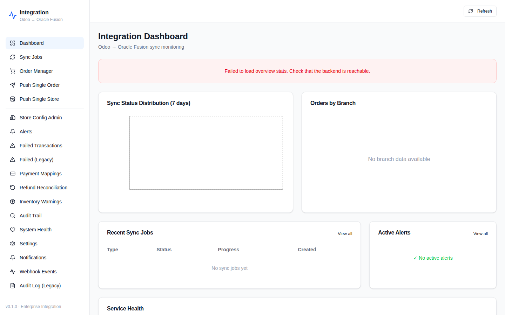

**Route:** `/`  
**Components:** OverviewCards (8 KPIs), SyncTrendChart (7-day bar), BranchOrdersChart (pie), SyncJobsTable, AlertsPanel, HealthStatusGrid  
**APIs:** `GET /dashboard/overview`, `/dashboard/sync-trend`, `/dashboard/orders-by-branch`, `/sync/jobs`, `/alerts`, `/dashboard/health`

---

### 2. Sync Jobs
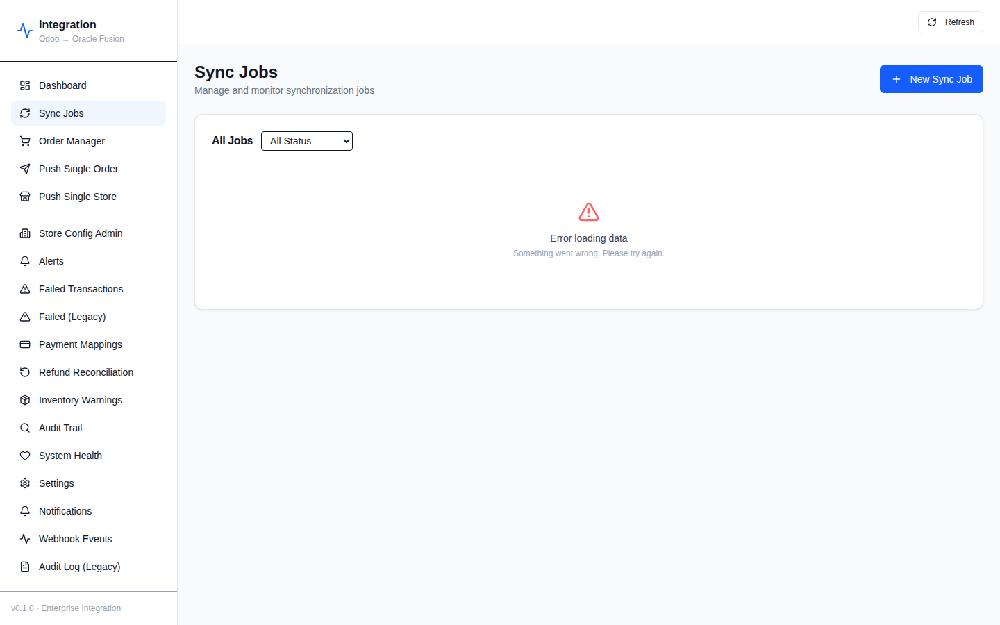

**Route:** `/sync-jobs`  
**Features:** List all sync jobs with status filter (PENDING/PROCESSING/COMPLETED/FAILED/PARTIAL/CANCELLED), retry/cancel actions, "New Sync Job" modal  
**APIs:** `GET /sync/jobs`, `POST /sync/jobs`, `POST /sync/jobs/:id/cancel`, `POST /sync/jobs/:id/retry`, `GET /sync/queue/stats`

---

### 3. Order Manager
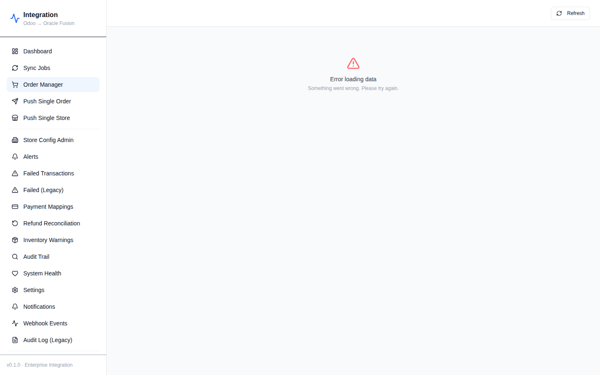

**Route:** `/orders`  
**Features:** Advanced filtering (date range, branch, status, customer), bulk retry, CSV export, validation error viewing  
**APIs:** `GET /sync/jobs`, `GET /sync/failed-transactions`

---

### 4. Push Single Order
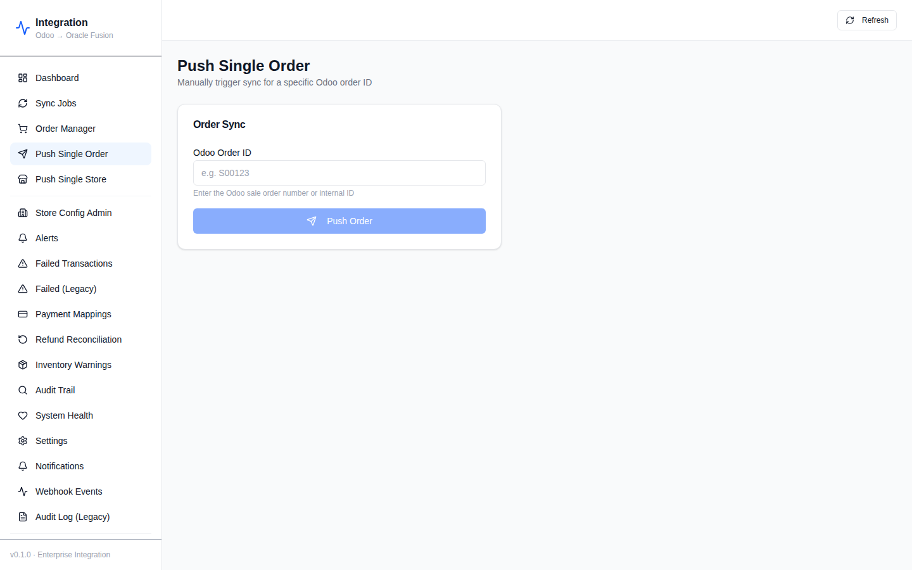

**Route:** `/push-order`  
**Features:** Manual order sync by Odoo order ID  
**API:** `POST /sync/jobs` with `scopeType: SINGLE_ORDER`

---

### 5. Push Single Store


**Route:** `/push-store`  
**Features:** Full branch sync via store dropdown  
**APIs:** `GET /store-config`, `POST /sync/jobs` with `scopeType: BRANCH`

---

### 6. Store Configuration Admin
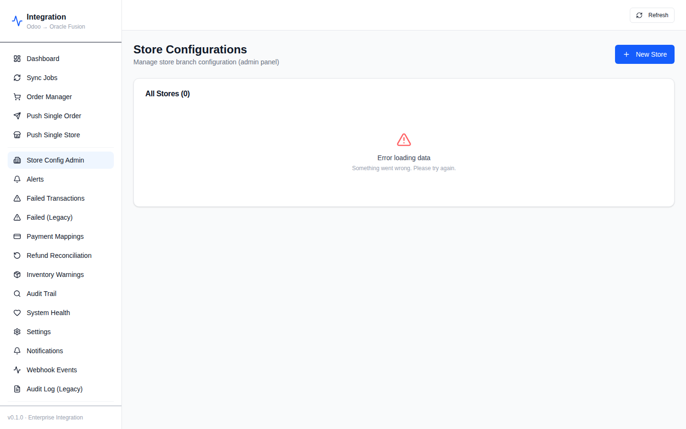

**Route:** `/stores`  
**Features:** CRUD operations for branch→Oracle mapping configs, per-store validation  
**APIs:** `GET /store-config`, `POST /store-config`, `PUT /store-config/:branchCode`, `DELETE /store-config/:branchCode`, `POST /store-config/:branchCode/validate`

---

### 7. Alerts
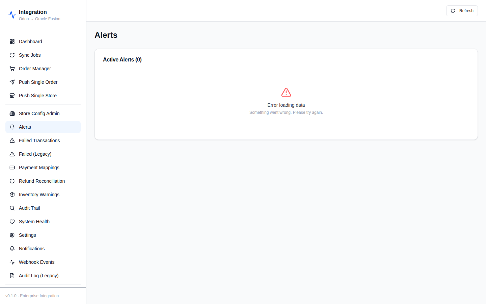

**Route:** `/alerts`  
**Features:** Filter by severity (INFO/WARNING/ERROR/CRITICAL) and resolved status, resolve alerts  
**APIs:** `GET /alerts`, `POST /alerts/:id/resolve`

---

### 8. Failed Transactions
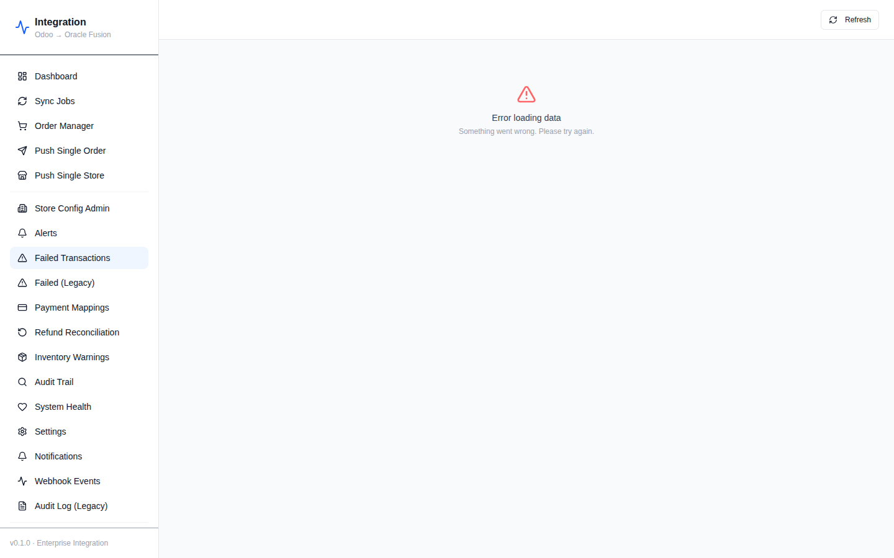

**Route:** `/failed`  
**Features:** View unresolved failed transactions with error details, resolve actions  
**APIs:** `GET /sync/failed-transactions`, `POST /sync/failed-transactions/:id/resolve`

---

### 9. Payment Method Mappings
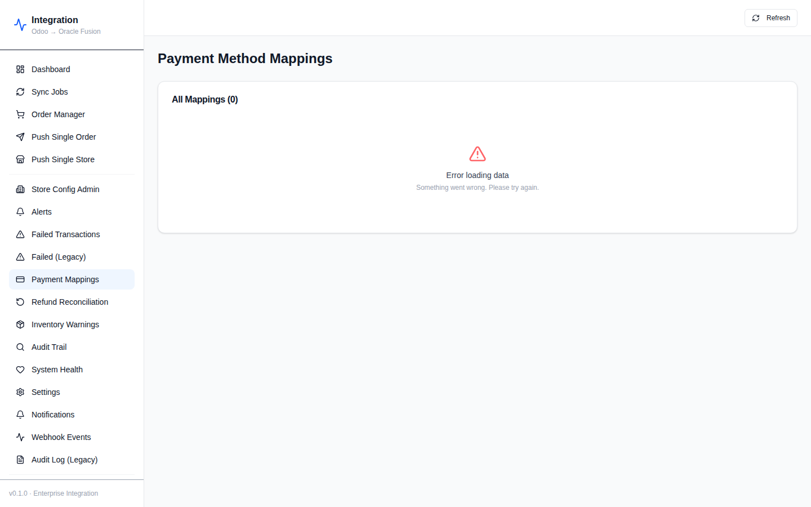

**Route:** `/payments`  
**Features:** Odoo→Oracle payment method mapping table, approve pending mappings  
**APIs:** `GET /payment-mappings`, `PUT /payment-mappings/:id/approve`

---

### 10. Refund Reconciliation
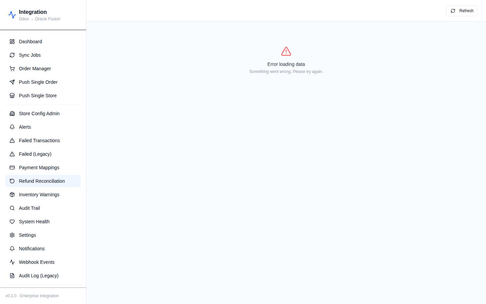

**Route:** `/refunds`  
**Features:** View refund tracking records, reconcile refunds, create manual credit memos  
**APIs:** `GET /refunds`, `PUT /refunds/:id/reconcile`, `POST /refunds/credit-memo`

---

### 11. Inventory Warnings
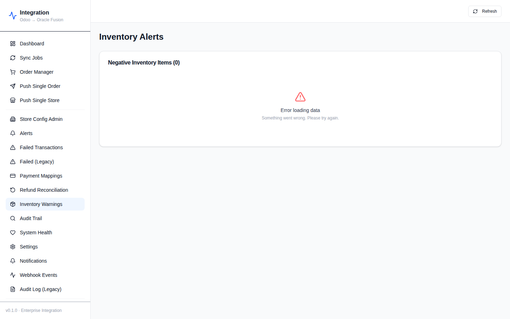

**Route:** `/inventory`  
**Features:** Negative inventory alert list, mark-as-reviewed workflow  
**APIs:** `GET /dashboard/negative-inventory`, `PUT /inventory/:id/review`

---

### 12. Audit Trail
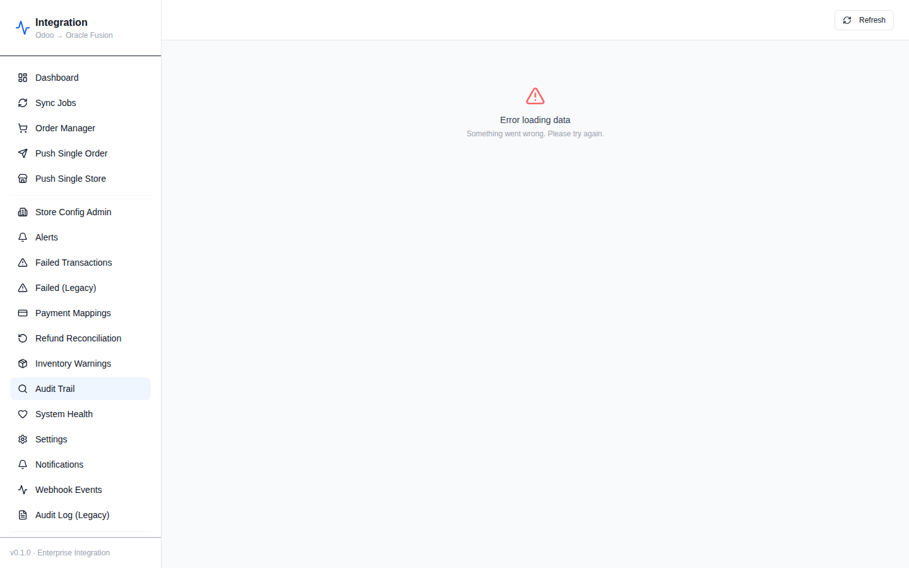

**Route:** `/audit`  
**Features:** Searchable audit log by order ID, entity type, action, date range, status  
**APIs:** `GET /audit`, `GET /audit/stats`, `GET /audit/:id`

---

### 13. System Health
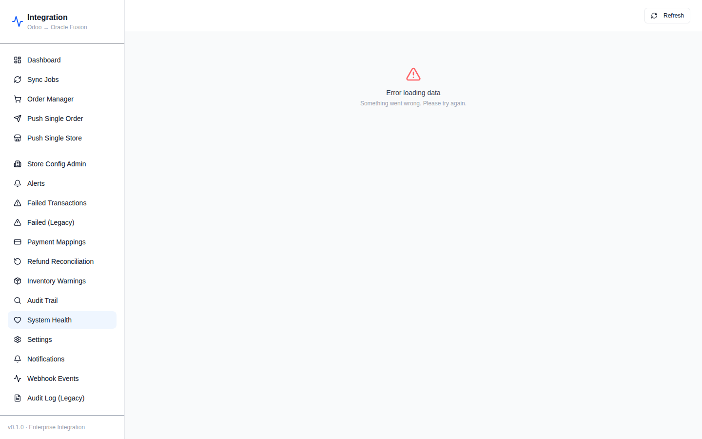

**Route:** `/health`  
**Features:** Service health status, queue depth stats, latency trends, error logs, trigger health check  
**APIs:** `GET /health/services`, `POST /health/check`, `GET /sync/queue/stats`, `GET /alerts`

---

### 14. Settings
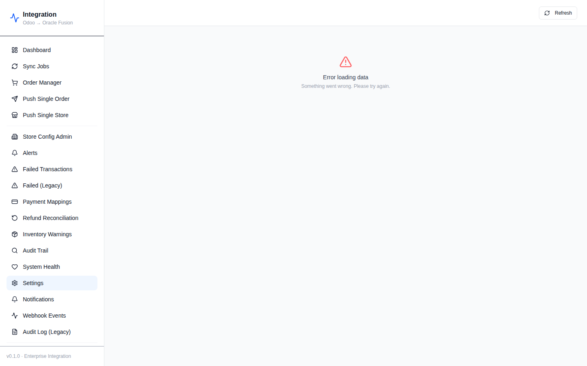

**Route:** `/settings`  
**Features:** Alert thresholds (failure rate, latency), sync schedule view, retry policy view  
**APIs:** `GET /settings`, `GET /settings/alert-thresholds`, `PUT /settings/alert-thresholds`, `GET /settings/sync-schedule`, `GET /settings/retry-policy`

---

### 15. Notification Recipients
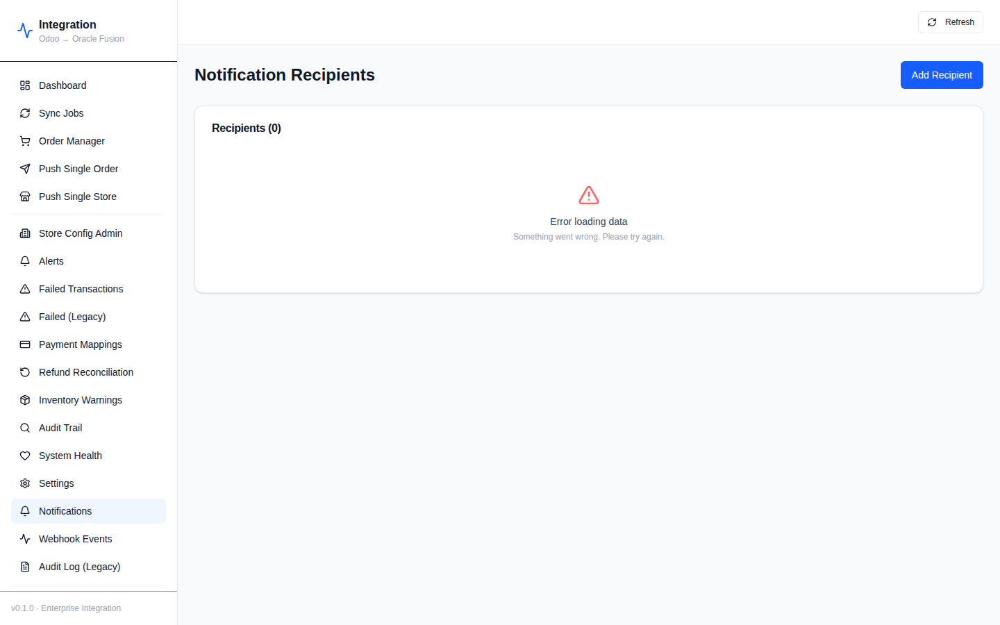

**Route:** `/notifications`  
**Features:** Add/edit/delete notification recipients with role-based alert preferences  
**APIs:** `GET /notifications/recipients`, `POST /notifications/recipients`, `PATCH /notifications/recipients/:id`, `DELETE /notifications/recipients/:id`

---

### 16. Webhook Events
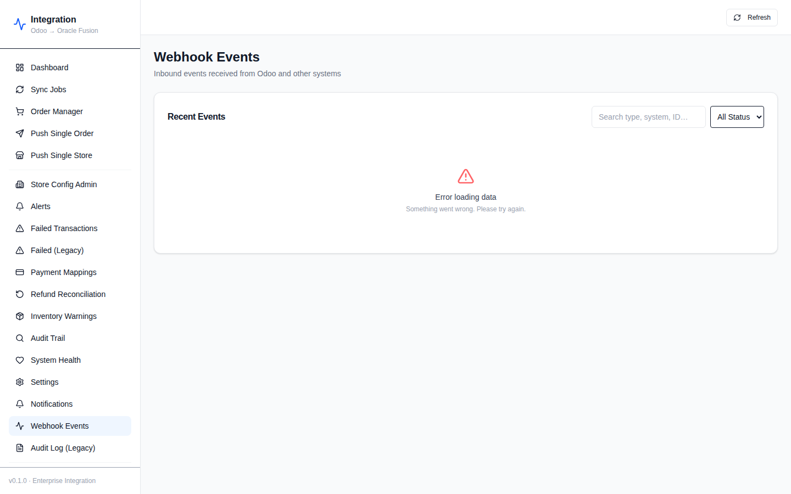

**Route:** `/webhooks`  
**Features:** Recent inbound webhook events viewer with search and status filter  
**APIs:** `GET /dashboard/webhook-events`

---

### 17. Admin Panel — Fusion Credentials
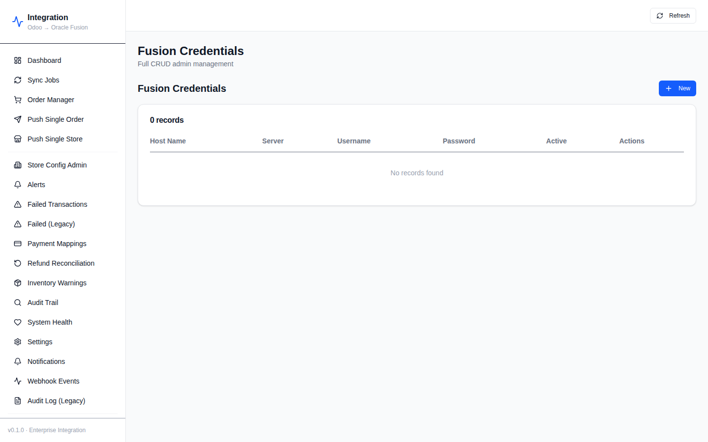

**Routes:** `/admin/fusion-credentials`, `/admin/vendhq-credentials`, `/admin/outlet-config`, `/admin/fusion-bu-map`, `/admin/fusion-receipt-methods`, `/admin/fusion-sales-metadata`, `/admin/service-provider-journal-meta`, `/admin/sales-integration-status`, `/admin/vendhq-outlets`, `/admin/vendhq-registers`, `/admin/vendhq-service-providers`, `/admin/vendhq-tax-meta`, `/admin/vendhq-discount-items`, `/admin/vendhq-item-meta`  
**Features:** Generic CRUD table with pagination, create/edit/delete dialogs, read-only archive views  
**APIs:** `GET /admin/tables`, `GET /admin/:table`, `GET /admin/:table/:id`, `POST /admin/:table`, `PUT /admin/:table/:id`, `DELETE /admin/:table/:id`

---

## Backend API Modules

| Module | Controller Prefix | Key Endpoints |
|--------|-------------------|---------------|
| **SyncModule** | `/sync` | `POST /jobs`, `GET /jobs`, `POST /jobs/:id/cancel`, `POST /jobs/:id/retry`, `GET /queue/stats`, `GET /failed-transactions`, `POST /failed-transactions/:id/resolve` |
| **WebhookModule** | `/webhooks` | `POST /odoo` (HMAC-verified, idempotent) |
| **DashboardModule** | `/dashboard` | `GET /overview`, `/sync-trend`, `/failed-transactions`, `/orders-by-branch`, `/recent-activity`, `/health`, `/negative-inventory`, `/webhook-events` |
| **AlertsModule** | `/alerts` | `GET /`, `POST /:id/resolve` |
| **StoreConfigModule** | `/store-config` | Full CRUD + `POST /:branchCode/validate` |
| **PaymentMappingModule** | `/payment-mappings` | `GET /`, `POST /`, `PUT /:id/approve` |
| **RefundsModule** | `/refunds` | `GET /`, `GET /stats`, `GET /:id`, `PUT /:id/reconcile`, `POST /credit-memo` |
| **InventoryModule** | `/inventory` | `GET /negative`, `GET /stats`, `GET /alert-history`, `PUT /:id/review` |
| **AuditModule** | `/audit` | `GET /`, `GET /stats`, `GET /:id` |
| **NotificationsModule** | `/notifications` | Full CRUD on `/recipients` |
| **SettingsModule** | `/settings` | `GET /`, `GET /alert-thresholds`, `PUT /alert-thresholds`, `GET /sync-schedule`, `GET /retry-policy` |
| **HealthModule** | `/health` | `GET /` (Terminus), `GET /services`, `POST /check` |
| **MetricsModule** | `/metrics` | `GET /` (Prometheus text format) |
| **AdminModule** | `/admin` | Generic CRUD over 20+ tables |
| **GatewayModule** | WebSocket `/events` | Real-time sync status events |

---

## Middleware Analysis — What's Present

✅ **Fully implemented middleware and security features:**

| Feature | Where | Notes |
|---------|-------|-------|
| **Helmet (CSP)** | `main.ts:23-36` | Custom CSP allows `unsafe-inline` for Swagger UI |
| **CORS** | `main.ts:38` | Configurable via `CORS_ORIGIN` env var |
| **Compression (gzip)** | `main.ts:37` | `compression` package enabled globally |
| **Rate Limiting (Throttler)** | `app.module.ts:33-44` | Short: 30 req/1s · Medium: 300 req/60s via `APP_GUARD` |
| **Global Validation Pipe** | `main.ts:41-46` | `whitelist:true`, `forbidNonWhitelisted:true`, `transform:true` |
| **HMAC-SHA256 Webhook Signature** | `webhook.service.ts` | Timing-safe comparison for Odoo webhook payloads |
| **Raw Body Capture** | `main.ts:18` | `rawBody:true` for webhook HMAC verification |
| **Idempotency Keys** | `idempotency.service.ts` | SHA-256 hash prevents duplicate Oracle calls |
| **Circuit Breaker** | `circuit-breaker.service.ts` | 3-state (CLOSED/OPEN/HALF_OPEN) for Oracle/Odoo clients |
| **Pino Structured Logging** | `app.module.ts:45-64` | HTTP request/response serialization |
| **API Versioning** | `main.ts:40` | URI-based (`/api/v1/`) |
| **Prometheus Metrics** | `metrics.controller.ts` | `GET /metrics` Prometheus text format |
| **Health Checks (Terminus)** | `health.controller.ts` | DB ping + 5-min cron health checks |
| **Bull Board Queue UI** | `main.ts:50-58` | Queue admin at `/queues` |
| **Swagger / OpenAPI** | `main.ts:60-69` | Full API docs at `/docs` with bearer auth schema |
| **Request-scoped logging** | `LoggerModule` | Pino request IDs on all logs |
| **Cron scheduler** | `ScheduleModule` | Health checks, daily sync scheduling |
| **Input size (implicit)** | NestJS defaults | JSON body limited by Express defaults |
| **Skip throttle on metrics/webhooks** | `@SkipThrottle()` | Intentionally exempt high-frequency endpoints |

---

## Middleware Analysis — What's Missing

### 🔴 CRITICAL

| Missing Feature | Risk | Recommendation |
|-----------------|------|----------------|
| **Authentication (JWT/API Key)** | Any user can call any endpoint including financial operations and credential management | Add `@nestjs/passport` + JWT strategy; apply `JwtAuthGuard` globally with `@Public()` decorator for webhooks/health/metrics |
| **Authorization (RBAC)** | No role enforcement — anyone can approve payment mappings, delete stores, modify settings | Add `RolesGuard` + `@Roles()` decorator; define roles: ADMIN, OPERATOR, VIEWER |
| **WebSocket Authentication** | Socket.IO gateway broadcasts real-time data to all connected clients without any token check | Add Socket.IO auth middleware checking JWT in handshake headers |

### 🟠 HIGH PRIORITY

| Missing Feature | Risk | Recommendation |
|-----------------|------|----------------|
| **Global Exception Filter** | Stack traces and internal error details exposed to API clients | Add `@Catch()` global filter that sanitizes 500 responses |
| **Request Correlation IDs** | Cannot trace a request across async queue processors and Oracle calls | Add `AsyncLocalStorage` middleware to propagate `x-request-id` through all log entries |
| **Webhook Rate Limiting** | `@SkipThrottle()` on `/webhooks/odoo` leaves it completely unprotected from DDoS floods | Apply a dedicated, higher-limit throttler (e.g., 1000/min) rather than fully skipping |
| **CORS locked to `*` by default** | Any origin can make credentialed requests to the API | Change default to explicit origin or list; require `CORS_ORIGIN` to be set in production |
| **Input body size limit** | Large payloads could exhaust memory | Add `app.use(bodyParser.json({ limit: '5mb' }))` in `main.ts` |
| **Admin endpoint protection** | `GET /admin/tables` exposes full DB schema; all admin routes are unprotected | At minimum add API key check; ideally full JWT + ADMIN role |

### 🟡 MEDIUM PRIORITY

| Missing Feature | Risk | Recommendation |
|-----------------|------|----------------|
| **Notification delivery** | `NotificationsService.sendAlert()` only logs — no email/Slack/webhook sent | Implement a queue processor that reads `NotificationRecipient` table and sends via SMTP/Sendgrid/Slack |
| **Circuit breaker state persistence** | In-memory state resets on pod restart — state lost in rolling deployments | Store open/close timestamps in Redis |
| **Optimistic locking on StoreConfig** | Concurrent updates can cause lost updates (`version` field incremented but not checked) | Add `where: { version: currentVersion }` check before update; throw 409 on mismatch |
| **Duplicate credit memo prevention** | Manual credit memo endpoint has no idempotency key | Require caller-supplied idempotency header or derive from `originalOrderId + refundOrderId` |
| **Auto-resolve stale alerts** | Negative inventory alerts and unresolved alerts accumulate indefinitely | Add TTL or scheduled job to auto-resolve alerts older than N days |

### 🔵 LOW PRIORITY

| Missing Feature | Notes |
|-----------------|-------|
| **HTTPS / HSTS enforcement** | Not in NestJS app (should be at load balancer / reverse proxy) |
| **Database credential rotation** | No mechanism to hot-reload Oracle/Odoo credentials without restart |
| **Cursor-based pagination** | All list endpoints use `take/skip` offset pagination; large tables will be slow |
| **Comprehensive test coverage** | Unit tests exist for 13 services but no integration/e2e tests with real DB |
| **Duplicate sidebar entries** | `/failed` and `/failed-transactions` are duplicates; `/activity` and `/audit` are duplicates — should be consolidated |

---

## Findings Summary

### ✅ Strengths
- All **153 unit tests pass** with zero failures
- Both **backend and frontend build cleanly** with no TypeScript errors
- **HMAC webhook signature verification** correctly implemented with timing-safe comparison
- **Idempotency** properly enforced via SHA-256 keys on Oracle calls and webhook ingestion
- **Circuit breaker** pattern correctly implemented for external service resilience
- **BullMQ with exponential back-off** provides reliable job retry
- **Timezone normalization** to UTC preserves original timezone metadata
- **Negative inventory** handled gracefully (sync proceeds, alert fires)
- **Selective sync scopes** (SINGLE_ORDER, DATE_RANGE, BRANCH, FAILED_ONLY) fully implemented
- **Prometheus metrics + Grafana** monitoring stack wired up
- **Full Swagger/OpenAPI** documentation generated automatically

### ❌ Blockers Before Production
1. **No authentication** — Every API endpoint is publicly accessible
2. **No authorization** — No role-based access control on any financial or admin operation  
3. **WebSocket unauthenticated** — Real-time data streams to any connected client
4. **Notifications not delivered** — Alert recipients configured but no emails/webhooks sent

### ⚠️ Redundant Pages to Clean Up
| Duplicate A | Duplicate B | Keep |
|-------------|-------------|------|
| `/failed` (Failed Transactions) | `/failed-transactions` (Failed Legacy) | `/failed` |
| `/audit` (Audit Trail) | `/activity` (Audit Log Legacy) | `/audit` |
